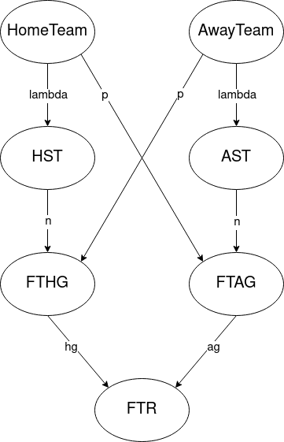
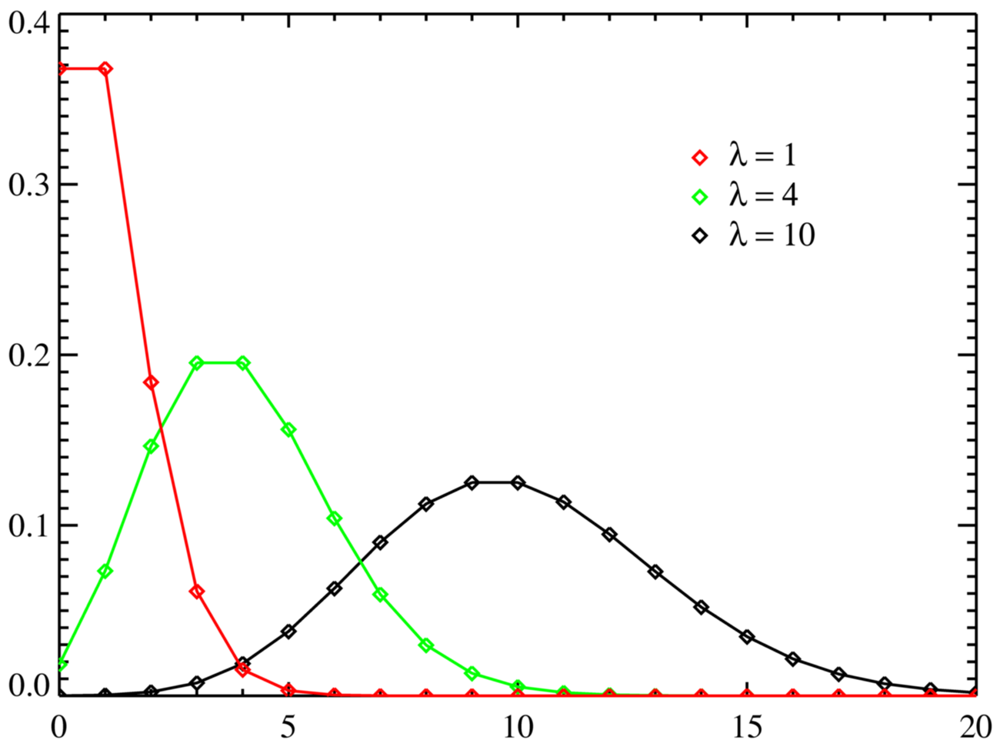
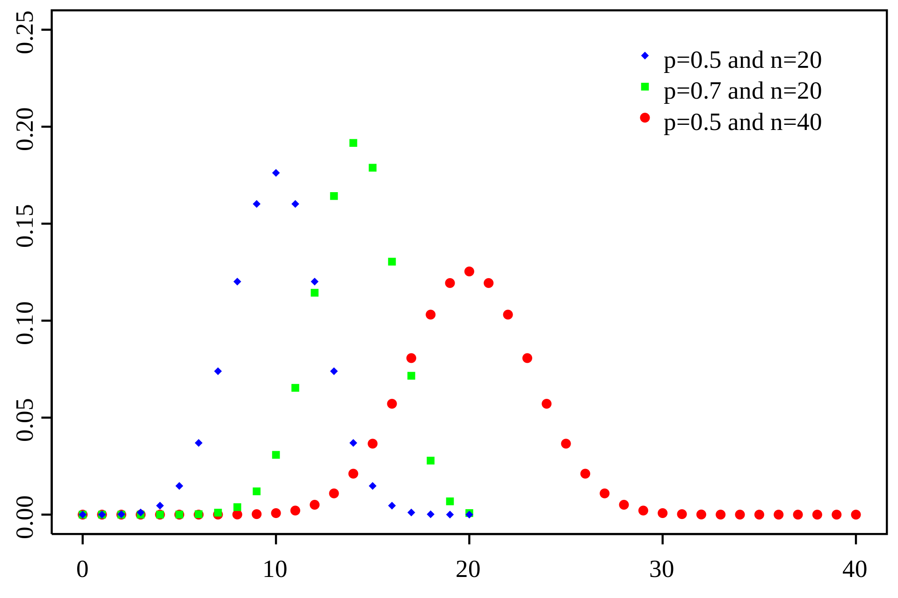

# Projekt-SIwR
Autor: Jakub Szczygieł

## Sieć bayesowska
System przewiduje wyniki meczów za pomocą sieci bayesowskiej o poniższej konstrukcji.



Węzły oznaczają kolejno nazwy grających drużyn, liczbę celnych strzałów na bramkę po obu stronach, liczbę goli każdej z drużyn i na koniec wynik meczu. Schematyczne zostały też przedstawione parametry używane przy wyliczaniu tablic prawdopodobieństw warunkowych.

## Wyliczanie liczby celnych strzałów
Aby wyliczyć prawdopodobieństwo konkretnej liczby strzałów używamy rozkładu Poissona, który określa prawdopidobieństwo szeregu zdarzeń w określonym czasie mając daną średnią częstotliwość ich występowania.



Rozkład Poissona posiada funkcję rozkładu prawdopodobieństwa f(k, &lambda;) = e<sup>-&lambda;</sup>&lambda;<sup>k</sup>/k! i używa parametru &lambda;, który wyznaczany jest dla każedej drużyny jako średnia liczba strzelonych goli w meczu.

## Wyliczanie liczby goli
Liczba goli zależy od liczby celnych strzałów oraz broniącej drużyny. Na podstawie danych wyliczane jest prawdopodobieństwo, że strzał na bramkę zakończy się golem dla każdej drużyny i jest ono wykorzystywane w rozkładzie Bernoulliego.



Rozkład ten opisuje prawdopodobieństwo danej liczby sukcesów znając liczbę prób a także prawdopodobieństwo pojedynczego sukcesu. Funkcja prawdopodobieństwa to f(k, n, p) = (<sup>n</sup><sub>k</sub>)p<sup>k</sup>(1-p)<sup>n-k</sup>.

## Wyznaczanie wyniku
Najprostszym rozkładem prawdopodobieństwa jest ten związany z wynikiem. Porównuje on po prostu liczbę goli obu drużyn i ustawia prawdopodobieństwo 1 w odpowiedniej kategorii.

## Opis programu
Program wczytuje z wejścia trzy łańcuchy znaków oznaczające kolejno datę (w formacie dd/mm/rrrr) i nazwy grających drużyn. Dodatkowo w folderze ze skryptem musi znajdować się plik data.csv z danymi do analizy. Dla wszystkich linijek z datą wcześniejszą niż ta podana zbierane są dane o drużynach. Na początku suma celnych strzałów, liczba meczy, suma goli przeciwników oraz suma celnych strzałów przeciwników. Następnie z tych danych wyliczane są średnia liczba goli w meczu i prawdopodobieństwo wpuszczenia gola. Jeżeli którejś z podanych drużyn nie ma w pliku, program się kończy. W przeciwnym wypadku, słownik z danymi o drużynach przekazywany jest do funkcji tworzącej sieć bayesowską według podanego schematu. Na końcu wykonywana jest inferencja dla podanych drużyn aby uzyskać rozkład prawdopodobieństwa wyniku, a najbardziej prawdopodobny rezultat wypisywany jest na wyjściu.

## Przykładowe wywołanie
Program mozna wywołać ręcznie z konsoli wpisując wymagane dane:
```
./main.py
01/01/2021
Everton
West Ham
A
```
albo można skorzystać z pliku tekstowego in, a wynik zapisać do pliku out:
```
./main < in > out
```
